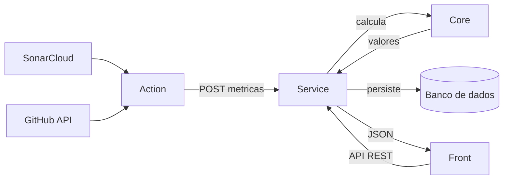
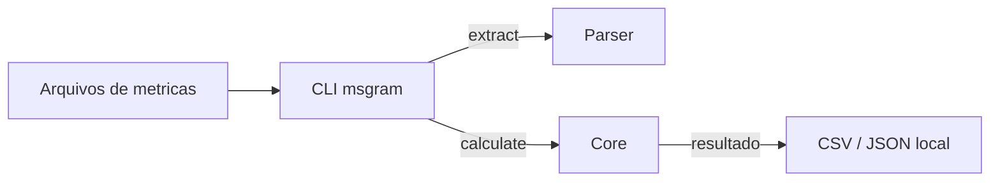

# Arquitetura

O MeasureSoftGram não é um programa único: é um **ecossistema de módulos
independentes**, cada um com uma responsabilidade bem definida, distribuídos em
repositórios separados. Essa divisão dá flexibilidade (dá para usar só uma
parte), mas também é o que mais confunde quem chega. Esta página explica o papel
de cada módulo e, principalmente, **como eles se conversam**.

## Os módulos

| Módulo | Responsabilidade | Stack |
| --- | --- | --- |
| **Core** | O núcleo de cálculo do modelo de qualidade. Recebe métricas e produz os valores das medidas, subcaracterísticas, características e a nota final. É uma biblioteca pura, sem banco nem servidor. | Python |
| **Parser** | Interpreta e normaliza os dados de entrada (relatórios do SonarQube, dados do GitHub) para o formato que o Core espera. | Python |
| **Service** | O backend. Recebe métricas via API REST, orquestra o cálculo chamando o Core e persiste tudo (métricas, configurações, análises, releases). | Python / Django |
| **Front** | A interface web. Consome a API do Service e apresenta os dashboards, a evolução da qualidade e o assistente de criação de release. | TypeScript / Next.js |
| **CLI** | A ferramenta de linha de comando. Permite extrair métricas e calcular o modelo localmente, direto do terminal, sem servidor. | Python |
| **Action** | A integração com pipelines de CI. Coleta métricas do SonarCloud e do GitHub e envia para o Service automaticamente a cada execução. | TypeScript |
| **AI** | Um servidor Model Context Protocol (MCP) que expõe a qualidade dos produtos a assistentes de IA compatíveis. | Python |
| **Plugin** | Extensão para editor (VS Code) que aproxima o MeasureSoftGram do fluxo de trabalho no código. | TypeScript |

## Dois modos de uso

A mesma pergunta ("qual a qualidade deste software?") pode ser respondida por
dois caminhos independentes, que compartilham o mesmo motor de cálculo (o Core)
mas se organizam de formas diferentes.

- **Hospedado (automatizado):** roda no CI. A Action coleta as métricas, o
  Service calcula e guarda, o Front mostra. É o modo para acompanhar a qualidade
  release a release, com histórico.
- **Offline (local):** roda na sua máquina, pelo CLI, sem servidor nenhum. É o
  modo para calcular a qualidade a partir de arquivos exportados, sem depender de
  infraestrutura.

## Fluxo hospedado, ponta a ponta

No modo hospedado, o dado sai do código do usuário e chega ao dashboard passando
por quatro módulos:

1. A cada execução do CI, a **Action** coleta as métricas brutas do SonarCloud e
   da API do GitHub.
2. A Action envia essas métricas para o **Service** por uma requisição HTTP.
3. O **Service** orquestra o cálculo, chamando o **Core** como biblioteca (no
   próprio processo, não por rede) para percorrer a hierarquia do modelo de
   qualidade (das medidas até a nota final).
4. O Service **persiste** o resultado no banco de dados.
5. O **Front** consulta a API do Service e renderiza os dashboards. A
   autenticação é feita por token.

## Fluxo offline (CLI)

No modo offline, não há servidor nem banco: o CLI usa o Core e o Parser como
bibliotecas, no próprio processo.

O fluxo típico é `init` (cria a configuração), `extract` (lê os arquivos de
métricas via Parser), `calculate` (roda o Core e gera o resultado) e, quando
necessário, `diff` (compara duas releases). Nada disso toca o Service. Veja o
passo a passo em [Como usar](./como-usar.mdx).

## O que é obrigatório

O **Core** é a única peça sempre presente: é o motor de cálculo dos dois modos.
O resto depende do caminho escolhido.

| Módulo | Modo hospedado | Modo offline |
| --- | --- | --- |
| Core | obrigatório | obrigatório |
| Parser | (coleta própria da Action) | obrigatório |
| Service + banco | obrigatório | não usado |
| Front | interface do modo hospedado | não usado |
| Action | dispara o fluxo no CI | não usado |
| CLI | não usado | é a interface |

:::note[Dois caminhos, um motor]
Os dois modos calculam com o mesmo Core, mas por rotas diferentes: o CLI o chama
no próprio processo; o Service o chama a partir do backend. Ao comparar
resultados do modo hospedado com os do modo offline, verifique se ambos usam a
mesma versão do Core, para que os números sejam comparáveis.
:::

## Para se aprofundar

Cada módulo tem seu próprio repositório na organização
[fga-eps-mds](https://github.com/fga-eps-mds), com README e instruções de
instalação e uso. Para entender o modelo matemático que o Core implementa, veja
[Modelo de qualidade](./modelo-de-qualidade.mdx). Para uma visão dos
repositórios ativos, veja [Repositórios ativos](./repos-ativos.mdx).
